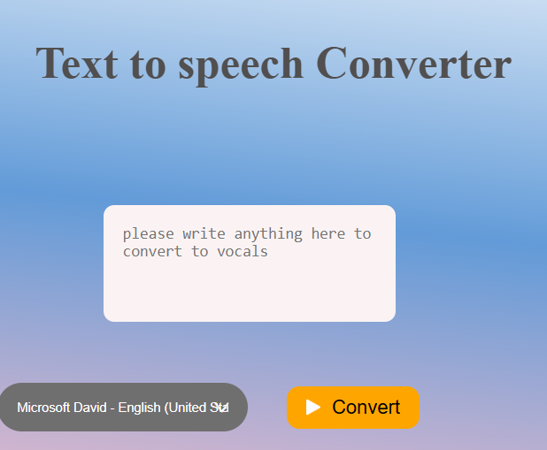

This is my Text to voice generator

In this website you can make text into voice by using the your browser tones

In this you can pick the voice you wanted first and then if you click the button it convert into voice

<video src="./images/videewo.mp4" controls="controls" style="max-width: 100%;"></video>

i used JS,HTML and CSS to make this website

You can use this command in git bash to download this files

git clone 

This is live url link:

if you like this Repo Please give me star

Thank you